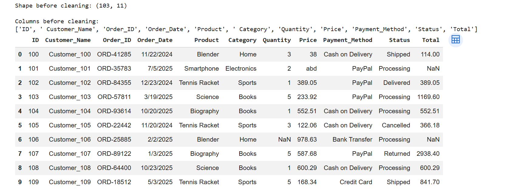
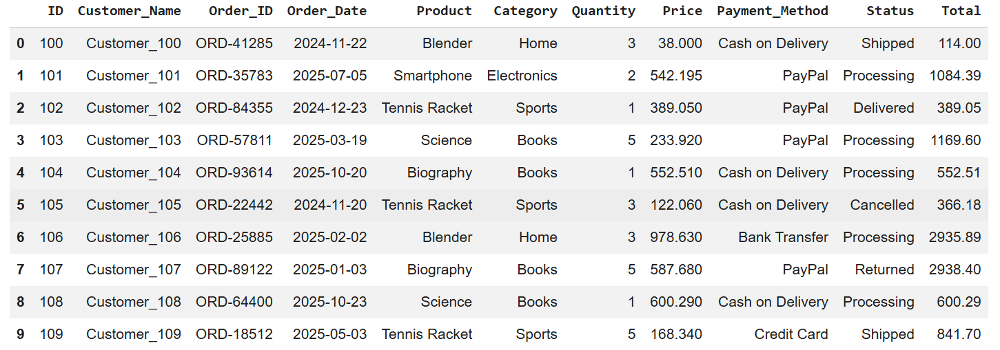

# Dataset Description – Messy E-commerce Sales Data

## Dataset source
- Dataset name: **Messy E-commerce Sales Data**
- Source website: **https://www.kaggle.com/datasets/kandeelai22/messy-e-commerce-sales-dataset**
- File used: `messy_ecommerce_sales_data.csv`

## Number of rows and columns
- Rows: **103**
- Columns: **11**

## Description of features (columns)
1. **ID** – Unique identifier for each record.
2. **Customer_Name** – Name or label of the customer who placed the order.
3. **Order_ID** – Unique order number.
4. **Order_Date** – Date when the order was placed.
5. **Product** – Product purchased in the order.
6. **Category** – Product category such as Electronics, Sports, Books, Home, or Clothing.
7. **Quantity** – Number of units ordered.
8. **Price** – Price of one unit of the product.
9. **Payment_Method** – Method used to pay for the order, such as PayPal, Credit Card, Bank Transfer, or Cash on Delivery.
10. **Status** – Current order status, such as Delivered, Shipped, Processing, Cancelled, or Returned.
11. **Total** – Total order value.

## Purpose of using this dataset
I selected this dataset because it is suitable for Exploratory Data Analysis (EDA).  
It contains realistic e-commerce sales information and also includes common data quality issues such as missing values, duplicates, inconsistent text labels, invalid numeric values, and mixed date formats.  
This makes it useful for practicing:
- data cleaning
- descriptive statistics
- data visualization
- extracting insights about sales patterns, product performance, and customer behavior

## Before Cleaning

## After Cleaning

